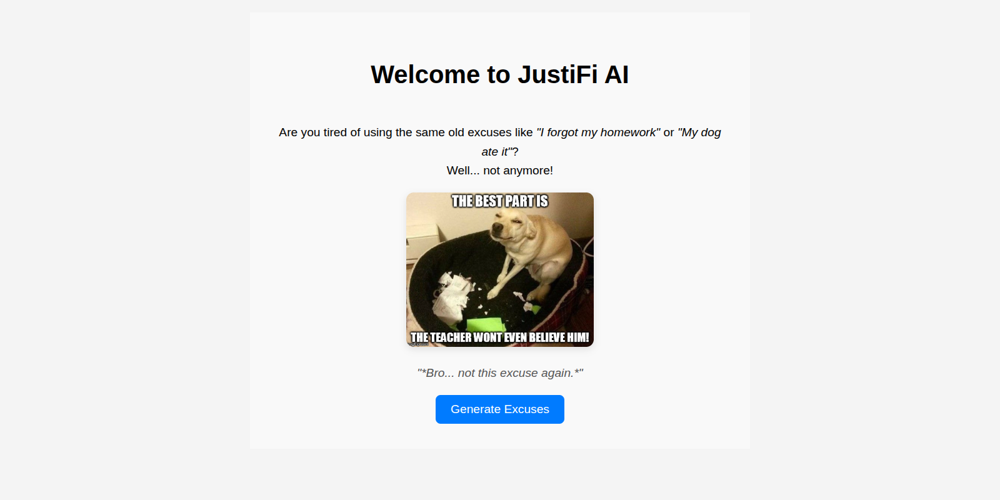
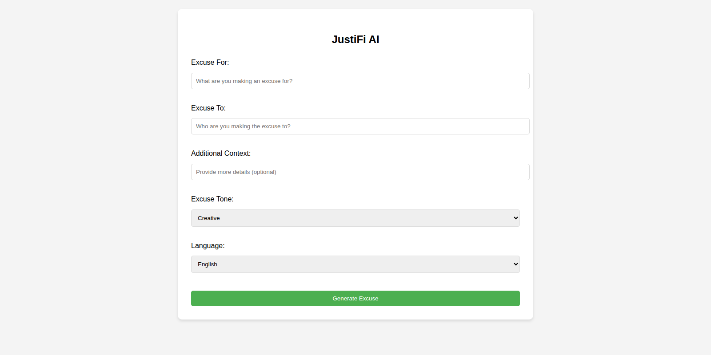

# 🧠 Justify AI

**Justify AI** is a web application powered by generative AI that creates smart, context-aware **excuses**. Whether you're late for a meeting, missed a deadline, or just need a tactful way out, Justify AI helps you respond gracefully — and creatively.

---

## 🚀 Tech Stack Overview

- **Frontend**: React.js
- **Backend**: AWS Lambda (Python-based serverless function)
- **API Integration**:
  - **AI**: Gemini API (for excuse generation)
  - **Routing**: AWS API Gateway
- **Hosting & Deployment**: AWS Amplify

---

## 🧩 Architecture Overview

The application architecture consists of a **React frontend** hosted on **AWS Amplify**, communicating with a **Python-based AWS Lambda function** through **API Gateway**. This serverless approach ensures scalable, low-maintenance compute. Excuse generation is powered by **Gemini API**, Google's large language model.

---

## 🖼️ Application Screenshots

### 🔹 App Interface

Users input a situation or context, and Justify AI generates a tailored excuse in real-time.

---

## 💡 Key Features

- 🧠 **Contextual Excuse Generation** – Personalized responses using Gemini API.
- 🔄 **Serverless Backend** – Scalable and cost-effective with AWS Lambda.
- 🌐 **Fully Web-Based** – Accessible on any modern device, no installation needed.
- ☁️ **Deployed on AWS** – Fast, reliable cloud infrastructure using Amplify.
- ⚛️ **Modern Frontend** – Built with React for a smooth and responsive UI.

---

## 🔧 How It Works

1. **User submits context** (e.g., “I missed class today.”)
2. **React frontend** sends the input to the backend via API Gateway.
3. **AWS Lambda function** receives the input and forwards it to **Gemini API**.
4. **Gemini API** returns a contextually appropriate excuse.
5. **Frontend displays** the generated excuse to the user.

---
